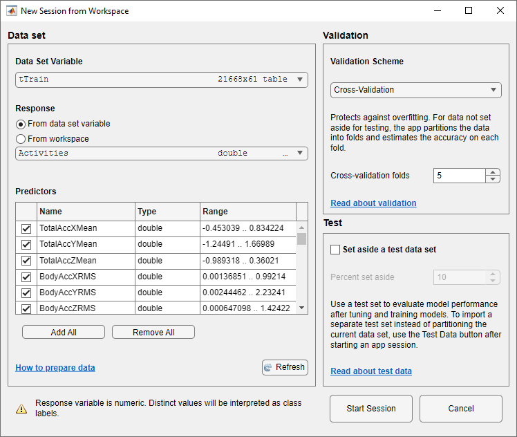
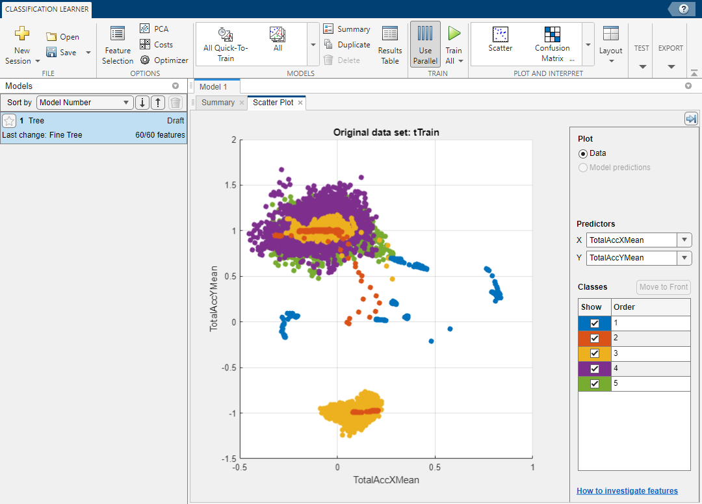
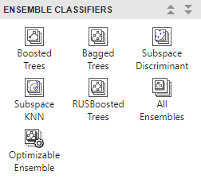
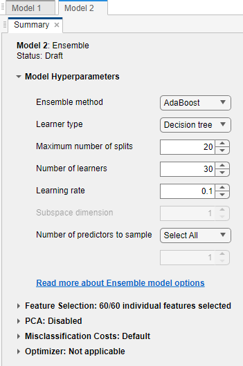
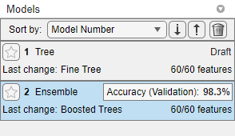

# Human Activity Classification

[](https://matlab.mathworks.com/open/github/v1?repo=yanndebray/human-activity-classification&file=prototype_setup.mlx)

This demo is inspired from the documentation example [Human Activity Recognition Simulink Model for Smartphone Deployment](https://www.mathworks.com/help/stats/human-activity-recognition-simulink-model-for-deployment.html) that classifies human activity based on smartphone sensor signals. 

# Set up environment

You are going to be using multiple threads to train models

```matlab
parpool("Threads")
```

# Load Sample Data Set

Load the `humanactivity` data set.

```matlab
load humanactivity
```

The `humanactivity` data set contains 24,075 observations of five different physical human activities: Sitting, Standing, Walking, Running, and Dancing. Each observation has 60 features extracted from acceleration data measured by smartphone accelerometer sensors. The data set contains the following variables:

-  `actid` — Response vector containing the activity IDs in integers: 1, 2, 3, 4, and 5 representing Sitting, Standing, Walking, Running, and Dancing, respectively 
-  `actnames` — Activity names corresponding to the integer activity IDs 
-  `feat` — Feature matrix of 60 features for 24,075 observations 
-  `featlabels` — Labels of the 60 features 

The Sensor HAR (human activity recognition) App \[1\] was used to create the `humanactivity` data set. When measuring the raw acceleration data with this app, a person placed a smartphone in a pocket so that the smartphone was upside down and the screen faced toward the person. The software then calibrated the measured raw data accordingly and extracted the 60 features from the calibrated data. For details about the calibration and feature extraction, see \[2\] and \[3\], respectively. The Simulink model described later also uses the raw acceleration data and includes blocks for calibration and feature extraction. 

# Prepare Data

This example uses 90% of the observations to train a model that classifies the five types of human activities and 10% of the observations to validate the trained model. Use [`cvpartition`](docid:stats_ug.brxwayf-1) to specify a 10% holdout for the test set.

```matlab
rng('default') % For reproducibility
Partition = cvpartition(actid,'Holdout',0.10);
trainingInds = training(Partition); % Indices for the training set
XTrain = feat(trainingInds,:);
YTrain = actid(trainingInds);
testInds = test(Partition); % Indices for the test set
XTest = feat(testInds,:);
YTest = actid(testInds);
```

Convert the feature matrix `XTrain` and the response vector `YTrain` into a table to load the training data set in the Classification Learner app.

```matlab
data = array2table([XTrain YTrain]);
```

Specify the variable name for each column of the table.

```matlab
data.Properties.VariableNames = [featlabels' 'Activities'];
```

Randomly downsample

```matlab
data = datasample(data(:,[1:3,61]),1000,Replace=false);
data.Activities = categorical(data.Activities);
data.Activities = renamecats(data.Activities,["1","2","3","4","5"],["Sitting","Standing","Walking","Running","Dancing"]);
```

# Train Boosted Tree Ensemble Using Classification Learner App

Train a classification model by using the Classification Learner app. To open the Classification Learner app, enter `classificationLearner` at the command line. Alternatively, click the **Apps** tab, and click the arrow at the right of the **Apps** section to open the gallery. Then, under **Machine Learning and Deep Learning**, click **Classification Learner**.

```matlab
classificationLearner(data,"Activities")
```

On the **Classification Learner** tab, in the **File** section, click **New Session** and select **From Workspace**. 


In the New Session from Workspace dialog box, click the arrow for **Data Set Variable**, and then select the table `tTrain`. Classification Learner detects the predictors and the response from the table.





The default option is 5\-fold cross\-validation, which protects against overfitting. Click **Start Session**. Classification Learner loads the data set and plots a scatter plot of the first two features.





On the **Classification Learner** tab, click the arrow at the right of the **Models** section to open the gallery. Then, under **Ensemble Classifiers**, click **Boosted Trees**.





The model **Summary**  tab displays the default settings of the boosted tree ensemble model.





On the **Classification Learner** tab, in the **Train** section, click **Train All** and select **Train Selected**. When the training is complete, the **Models** pane displays the 5\-fold, cross\-validated classification accuracy.





On the **Classification Learner** tab, click **Export**, click **Export Model**, and select **Export Model** . In the Export Classification Model dialog box, clear the check box to exclude the training data and export a compact model, and then click **OK** . The structure `trainedModel` appears in the MATLAB® workspace. The field `ClassificationEnsemble` of `trainedModel` contains the compact model. Extract the trained model from the structure.

```
classificationEnsemble = trainedModel.ClassificationEnsemble;
```
